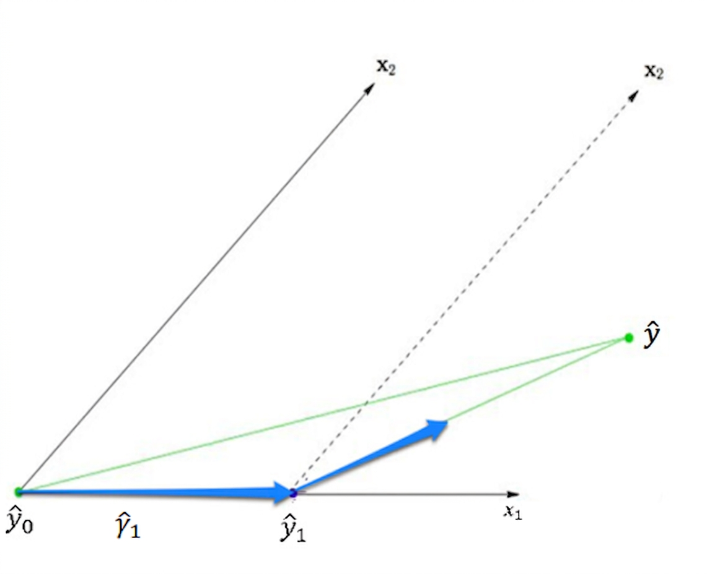
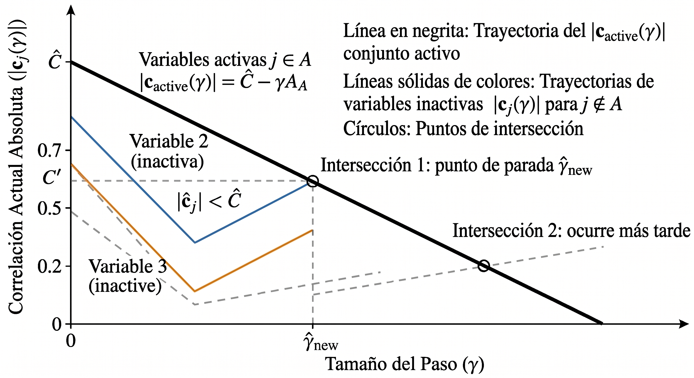

# Regresión por menor ángulo (LARS)

## Intuición detrás de LARS

Notemos que la regresión por pasos tiene la ventaja de que llega a una solución en a lo más $\min\{n,p\}$ pasos, pero como mencionamos antes, como añadimos "mucho" de un predictor en cada iteración, podemos, sin darnos cuenta, eliminar alguno que fuera relevante. El algoritmo regresión por etapas intenta resolver este problema, pero al costo de introducir muchas iteraciones. El objetivo de el algoritmo de regresión por menor ángulo es obtener los beneficios de ambos realizando decisiones "inteligente" de que predictores añadimos en cada paso y "cuanto" añadimos de cada uno.

Al igual que en los dos algoritmos anteriores, la idea es añadir predictores hasta que estemos satisfechos. Tomemos primero el caso donde

$$
X=\begin{bmatrix}
x_{1,1}&x_{1,2}\\
x_{2,1}&x_{2,2}
\end{bmatrix}.
$$

Supongamos que $|\langle x_1,y\rangle|>|\langle x_2,y\rangle|$, de manera que si $\theta_1$ es el ángulo entre $x_1, y$ y $\theta_2$ es el ángulo entre $x_2,y$, entonces

$$
|\cos(\theta_1)|~||y||=|\langle x_1,y\rangle|>|\langle x_2,y\rangle|=|\cos(\theta_2)|~||y||\Rightarrow |\cos(\theta_1)|>|\cos(\theta_2)|.
$$

Esto nos dice que $|\cos(\theta_1)|$ está más cercano a 1, y por tanto, como $\cos(0)=\cos(\pi)=1$, se tiene que si consideramos la recta marcada por $y$, entonces el ángulo formado por $x_1$ y dicha recta es más pequeño que el formado por $x_2$, como se observa en la @fig-LARS, de modo que damos un paso en esta dirección (considerando el signo que tiene $\langle x_1,y\rangle$). Ahora bien, vamos a dar un tamaño de paso muy especial. Como el algoritmo termina en el siguiente paso y queremos llegar a la solución usual de mínimos cuadrados, consideramos un tamaño de paso $\hat\gamma_1$ de manera que si $\hat y$ es dicho estimador, entonces $\hat y-\hat\gamma_1 x_1$ biseque el ángulo entre $x_1$ y $x_2$, esto es que $\hat y-\hat\gamma_1 x_1$ tenga la misma correlación con $x_1$ y $x_2$, de manera que nuestra estimación actual es $\hat\gamma_1 x_1$. Después, continuamos en la dirección marcada por dicha bisectriz, específicamente, si $u_2$ es el vector unitario que biseca dicho ángulo, entonces nuestra siguiente estimación es $\hat\gamma_1 x_1+\hat\gamma_2 u_2$, donde $\hat\gamma_2$ es elegido para que la estimación final sea $\hat y$.

{#fig-LARS fig-align="center"}

Notemos que el algoritmo por pasos hubiera elegido $\hat\gamma_1=\hat\beta_1$, mientas que el algoritmo por etapas hubiera seguido un camino escalonado a partir de $\hat\gamma_1 x_1$ para llegar a $\hat y$, mientras de que LARS elige un camino intermedio.

## Algoritmo LARS en el caso general

Como vimos antes, para dos vectores, el algoritmo toma la dirección de la bisectriz entre ellos. Podemos generalizar este concepto para más vectores:

::: {#def-equia .border .rounded .shadow-sm .p-3 .mb-3 name="Vector equiangular"}
Sean $\{x_1,\dots, x_r\}$ vectores y $X$ la matriz cuyas columnas son dichos vectores. Decimos que un vector $u$ es equiangular a los vectores $\{x_1,\dots, x_r\}$ si

$$ X^T u=\begin{bmatrix} \alpha\\ \vdots\\ \alpha \end{bmatrix}, $$

para alguna constante $\alpha$.
:::

Es natural preguntarse cuando podemos encontrar vectores equiangulares, para ello tenemos el siguiente resultado:

::: {#thm-exis .border .rounded .shadow-sm .p-3 .mb-3 name="Existencia de vectores equiangulares"}
Supongamos que $\{x_1,\dots, x_n\}$ son linealmente independientes. Entonces, existe un vector equiangular a dichos vectores que además es unitario.
:::

::: {.callout-important collapse="true" appearance="minimal" icon="false"}
## Demostración

Sea $W$ la matriz con columnas $\{x_1,\dots, x_r\}$. Notemos que trivialmente se cumple que $I\mathbf 1_n=\mathbf 1_n$, de manera que

$$ (W^TW)(W^TW)^{-1}\mathbf 1_n=\mathbf 1_n. $$

Así, si hacemos $u'=W(W^TW)^{-1}\mathbf 1_n$, entonces tenemos un múltiplo del vector $u$ buscado. Además, como

$$ \begin{aligned} ||u'||^2&=\mathbf 1_n(W^TW)^{-1} W^TW(W^TW)^{-1}\mathbf 1_n\\ &=\mathbf 1_n(W^TW)^{-1}\mathbf 1_n \end{aligned}, $$

se tiene que

$$ u=\frac{W(W^TW)^{-1}\mathbf 1_n}{[\mathbf 1_n (W^TW)^{-1}\mathbf 1_n]^{\frac 12}}, 
$$

es un vector equiangular y además notemos que en este caso $\alpha=[\mathbf 1_n(W^TW)^{-1}\mathbf 1_n]^{-\frac 12}>0$.
:::

Con esto, podemos describir nuestro algoritmo. Sea $\hat y_{\mathcal A}$ nuestra estimación actual, donde $\mathcal A\subseteq \{1,\dots, \min\{n,p\}\}$ nos indica los ínidices que los predictores que hemos agregado. Si $c_{\mathcal A}=X^T(y-\hat y_{\mathcal{A}})$ es el vector de correlaciones parciales @eq-corrpa, definimos

$$
\hat C_\mathcal A=\hat C=\max_j\{|c_j|\},\quad \mathcal A=\{j:|c_j|=\hat C\},
$$y también

$$
s_j=\text{sign}(c_j),\quad j\in \mathcal A.
$$

Con esto, definimos la matriz

$$ X_{\mathcal A}=(\cdots s_jx_j\cdots)_{j\in \mathcal A}, $$

donde las columnas están ordenadas de acuerdo a como van entrando predictores. Con esto, consideremos el vector del @thm-exis

$$ u_\mathcal A =\frac{X_\mathcal A(X^T_{\mathcal A} X_{\mathcal A})^{-1}\mathbf 1_{|\mathcal A|}}{[\mathbf 1_{|\mathcal A|}(X_{\mathcal A}^TX_{\mathcal A})^{-1}\mathbf 1_{|\mathcal A|}]^{\frac 12}}, $$ {#eq-ua}

que es equiangular con $\{s_jx_j\}_{j\in \mathcal A}$ y unitario. Tenemos entonces la dirección que seguimos en nuestro siguiente paso, resta ver la magnitud con la que aumentamos. Primeramente notemos que si $\gamma>0$ y definimos

$$
c_j(\gamma)=x_j^T(y-\hat y_\mathcal A -\gamma u_\mathcal A)=c_j-\gamma\langle x_j,u_\mathcal A\rangle=c_j-\gamma s_jk_{\mathcal A},
$$ {#eq-corrlars}

donde $k_{\mathcal A}=[\mathbf 1_{|\mathcal A|}(X^T_{\mathcal A}X_{\mathcal A})^{-1}\mathbf 1_{|\mathcal A|}]^{-\frac 12}>0$ . Entonces, para $j\in \mathcal A$ se tiene que

$$
|c_j(\gamma)|=|s_j \hat C-\gamma s_jk_{\mathcal A}|= \hat C-\gamma k_{\mathcal A},
$$ {#eq-clave}

para $\gamma\leq \frac{\hat C}{k_\mathcal A}$. La ecuación anterior es la clave para el algortimo funcione, esta nos dice que para valores pequeños de $\gamma$, $|c_j(\gamma)|$ decrece de manera lineal para $j\in \mathcal A$. Además, para $j\notin \mathcal A$, si $c_j\geq 0$ y $\gamma\leq \frac{c_j}{k_\mathcal A}$, entonces

$$
|c_j(\gamma)|=c_j-\gamma k_{\mathcal A}\leq \hat C-\gamma k_{\mathcal A},
$$

y si $c_j<0$ y $\gamma\leq \frac{-c_j}{k_{\mathcal A}}$ , entonces

$$
|c_j(\gamma)|=-c_j-\gamma k_\mathcal A\leq \hat C-\gamma k_\mathcal A.
$$

Esto quiere decir que, partiendo de $\gamma=0$, las correlaciones absolutas para $j\notin \mathcal A$ son menores que las de $j\in \mathcal A$ y estas últimas decrecen de manera constante. Nos interesa entonces el valor no negativo más pequeño $\hat \gamma$ en tal que se cumpla la igualdad que se obtiene al igualar el lado derecho de @eq-clave y @eq-corrlars:

$$
|c_j(\gamma)|=|c_j-\gamma s_j k_\mathcal A|=\hat C-\gamma k_\mathcal A,\quad j\notin \mathcal A.
$$ {#eq-gamma}

En la @fig-gamma podemos ver como encontramos gráficamente el valor de $\hat\gamma$.

{#fig-gamma fig-align="center"}

Tenemos de la @eq-gamma que

$$
\hat\gamma=\min^+_{j\in \mathcal A^C}\left\{\frac{\hat C-c_j}{k_\mathcal A-s_jk_\mathcal A},\frac{\hat C+c_j}{k_\mathcal A+s_jk_\mathcal A}\right\}.
$$ {#eq-gammareal}

donde el mínimo se toma sobre valores no negativos, y notemos que se cumple la @eq-clave con $\hat\gamma$ pues si $c_j\geq 0$, entonces $s_j=1$ y por tanto

$$
\hat C+c_j\leq 2 k_\mathcal A\frac{\hat C}{k_\mathcal A}\Rightarrow \frac{\hat C+c_j}{k_\mathcal A+s_jk_\mathcal A}\leq \frac{\hat C}{k_\mathcal A},
$$

y si $c_j\leq 0$, entonces $s_j=-1$ y por tanto

$$
\hat C-c_j\leq 2 k_\mathcal A\frac{\hat C}{k_\mathcal A}\Rightarrow \frac{\hat C-c_j}{k_\mathcal A-s_jk_\mathcal A}\leq \frac{\hat C}{k_\mathcal A}.
$$

Así, de manera compacta tenemos que nuestro algoritmo se actualiza a

$$
\mathcal A\longleftarrow \mathcal A\cup\{\hat j\},\quad \hat C\longleftarrow  \hat C-\hat\gamma k_{\mathcal A},\quad \hat y_{\mathcal A}\longleftarrow \hat y_\mathcal A+\hat\gamma u_\mathcal A,
$$donde $\hat j$ es el $\arg\min$ en la @eq-gammareal.

Lo anterior está bien definido para cada etapa del algoritmo salvo en el último paso, pues al final $\mathcal A^c=\varnothing$. El objetivo final del algoritmo es recuperar la solución de mínimos cuadrados. Supongamos que tenemos la estimación actual $\hat y_\mathcal A$ y sea $\overline y_\mathcal A$ la solución de mínimos cuadrados actual. Entonces,

$$
\overline y_\mathcal A=\hat y_\mathcal A+X_\mathcal A(X_\mathcal A^TX_\mathcal A)^{-1}X_\mathcal A^T(y-\hat y_\mathcal A)=\hat y_\mathcal A+\frac{\hat C_\mathcal A}{k_\mathcal A}u_\mathcal A,
$$pues $\hat y_\mathcal A$ por construcción está en el espacio generado por los vectores $\{x_i\}_{i\in \mathcal A}$ y recordando la @eq-ua. Como $u_\mathcal A$ es unitario, se cumple que

$$
||\hat y_\mathcal A-\overline y_\mathcal A||=\frac{\hat C_\mathcal A}{k_\mathcal A},
$$entonces nunca llegamos a la solución de mínimos cuadrados, y si queremos llegar a ella al final, requerimos que en la última iteración,

$$
\hat\gamma=\frac{\hat C_\mathcal A}{k_\mathcal A},\quad \mathcal A=\{1,\dots, \min\{n,p\}\}.
$$

Esto describe completamente a nuestro algoritmo.

## Con qué subconjunto nos quedamos?

Si $n<p$ nuestro algoritmo se detiene cuando ha añadido $n$ variables. Sin embargo, cuando $p\geq n$ nuestro lagoritmo no se detiene hasta añadir todas las variables. Veamos ahora un criterio que nos ayuda a elegir un subconjunto apropiado de variables para nuestro modelos.

::: {#def-Cp name="Estadístico $C_p$"}
Para el modelo de regresión lineal usual @eq-modelo, si $\mu=X\beta$ es el vector de medias de $y$, definimos para un ajuste $\hat y$ el estadístico,

$$
C_p(\hat y)=\mathbb E\left[\frac{||\hat y-\mu||^2}{\sigma^2}\right],
$$que no es más que el valor esperado del error de predicción escalado con la varianza.
:::

Notemos que la suma de cuadrados residuales siempre se hace más pequeña mientras más variables agregamos a nuestro modelo, mientras que nuestro estadístico $C_p$ no tiene por que. Ahora bien, notemos que para $1\leq i\leq n$ podemos escribir

$$
(\hat y_i-\mu_i)^2=(y_i-\hat y_i)^2-(y_i-\mu_i)^2+2(\hat y_i-\mu_i)(y_i-\mu_i),
$$ de manera que

$$
C_p(\hat y)=\mathbb E\left[\frac{||y-\hat y||^2}{\sigma^2}\right]-n+2\sum_{i=1}^n\frac{\text{Cov}(\hat y_i,y_i)}{\sigma^2}.
$$

Usualmente no conocemos la varianza, por lo que podemos reemplazar lo anterior con su estimador insesgado del modelo completo. Más aún, se puede probar que bajo ciertas condiciones se tiene que

$$
C_p(\hat y_k)=\mathbb E\left[\frac{||y-\hat y_k||^2}{\hat\sigma^2}\right]-n+2k,
$$donde $\hat y_k$ es el estimador en el $k$-ésimo paso de nuestro algoritmo, y aunque no se tenga la igualdad, esta es una buena aproximación para el estimador. Nos interesa entonces encontrar el paso de nuestro algoritmo donde se minimice este estadístico.

::: {.callout-note collapse="true" appearance="minimal" icon="false"}
## Ejemplo

Consideremos de nuevo nuestra base de datos de diabetes. Al realizar la regresión obtenemos los siguientes caminos para $\beta$.

```{r}
#| code-fold: true

library("lars")
data(diabetes)
X = diabetes$x
y = diabetes$y

res = lars(X, y, type = "lar")
plot(res, xvar = "step")
```

Podemos ver de nuevo que los caminos de $\beta$ obtenidos son muy similares a los de Lasso y regresión por etapas. Ahora bien, también tenemos la siguiente gráfica para los estadísticos $C_p$.

```{r}
#| code-fold: true

plot(seq(4,10,by = 1), res$Cp[5:11], type = "o", xlab = "Step", ylab = "Cp estimado", main = "LAR")


```

Podemos ver que el $C_p$ estimado más pequeño fue en el paso 7 seguido muy cerca del paso 8, por lo que ambos modelos son considerados plausibles en este caso.
:::
